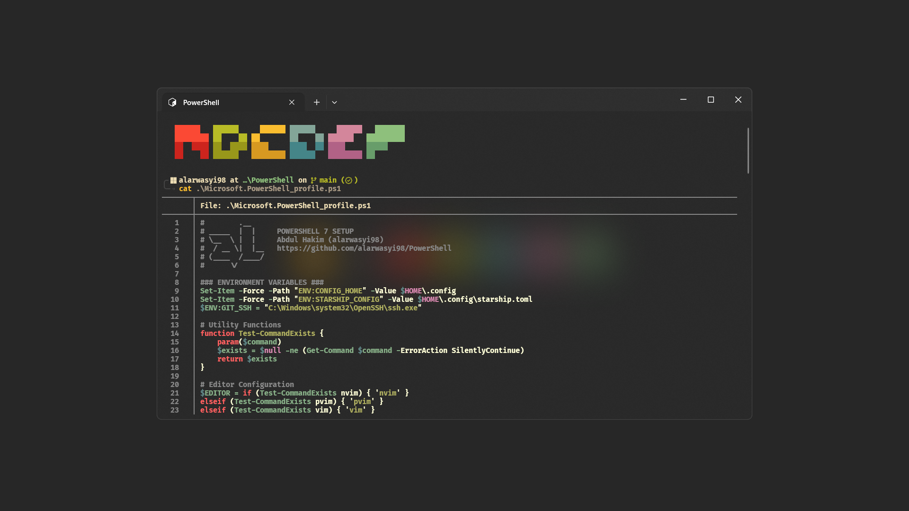

# PowerShell Profile


This repository contains the configuration files and scripts for my
[PowerShell](https://github.com/PowerShell/) setup. It includes my PowerShell
profile, modules, and various utility scripts. Checkout the
[Official Documentation](https://learn.microsoft.com/en-us/powershell/module/microsoft.powershell.core/about/about_profiles?view=powershell-7.4)
to generate your own profile.



> To get the perfect experience, make sure FiraCode NerdFont is installed and
> set it up to bold. I installed it via-[Scoop](htps://scoop.sh)

## Repository Structure

The repository is organized as follows dependencies:

| Section                   | Description                                                                                          |
| ------------------------- | ---------------------------------------------------------------------------------------------------- |
| **Applications**          | These are the external applications that are a dependency for my PowerShell setup.                   |
| **Modules**               | These are the PowerShell modules that I have installed and configured.                               |
| **Scripts**               | These are the custom PowerShell scripts that I have created for various purposes.                    |
| **Additional Repository** | These are the additional Git repositories that I have integrated into my PowerShell setup.           |
| **Colorscheme**           | Color properties of most components in my [Windows Terminal](https://github.com/microsoft/terminal). |

### Applications

| Application                            | Description                        |
| -------------------------------------- | ---------------------------------- |
| [chocolatey](https://chocolatey.org/)  | Package manager for Windows        |
| [neovim](https://neovim.io/)           | Vim-based text editor              |
| [starship](https://starship.rs)        | Cross-shell prompt                 |
| [git](https://git-scm.com)             | Distributed version control system |
| [fzf](https://github.com/junegunn/fzf) | Fuzzy finder                       |

### Modules

> [!NOTE]
> I intentionally ignoring Module's folder because of performance issues
> and different users might need different versions of modules

| Module                                                                | Description                                     |
| --------------------------------------------------------------------- | ----------------------------------------------- |
| [Terminal-Icons](https://github.com/devblackops/Terminal-Icons)       | Provides file icons for the terminal            |
| [PSReadline](https://github.com/PowerShell/PSReadLine)                | Enhances the PowerShell command-line experience |
| [Command-Not-Found](https://github.com/PowerShell/command-not-found)  | Provides suggestions for missing commands       |
| [PSWebSearch](https://github.com/JMOrbegoso/PSWebSearch)              | Provides Googling through PowerShell            |
| [ps-color-scripts](https://github.com/scottmckendry/ps-color-scripts) | Derek Taylor's colorscripts fork                |

### Scripts

> [!CAUTION]
> Always review codes that you get outside to avoid system failure etc.
> Make sure you have idea what you do.

| Script                | Description                                        |
| --------------------- | -------------------------------------------------- |
| `Install-Deps` (BETA) | Installing Dependencies that support this profile  |
| `Build-Git`           | Sets up Git configuration and aliases              |
| `Get-Linux`           | Retrieves information about the Linux environment  |
| `Windows-Utility`     | Provides various Windows-related utility functions |
| `Remove-Neovim`       | Reset the Neovim Configurations                    |
| `Install-BuildTools`  | Installs the necessary build tools                 |

> [!IMPORTANT]
> Most of the scripts is an unsigned scripts.
> So if you trust the script, `Set-ExecutionPolicy` to `Unrestricted`,
> `RemoteSigned`, or `ByPass` before you run the script.

### Additional Repository

| Repository      | Description                               |
| --------------- | ----------------------------------------- |
| `PSGallery`     | The official PowerShell script repository |
| `PowerShellGet` | The official PowerShell module repository |

### Colorscheme

| Colorscheme                                                             | Description                                   |
| ----------------------------------------------------------------------- | --------------------------------------------- |
| [Gruvbox](https://github.com/morhetz/gruvbox)                           | A theme with pastel 'retro groove' colors     |
| [Catppuccin Mocha](https://github.com/catppuccin/windows-terminal)      | Soothing pastel theme for Windows Terminal    |
| [Dracula](https://github.com/dracula/windows-terminal) (currently used) | Dracula Theme for Windows Terminal dark theme |

## Usage

To use this PowerShell configuration, simply clone this repo to your local machine.

> [!NOTE]
> Open a PowerShell terminal (version 7. or higher) and from the `PS C:\Users\username\Documents>` prompt, then run the following command:

```sh
git clone https://github.com/alarwasyi98/PowerShell.git
```

1. Clone the repository to your local machine.
2. Run the necessary setup scripts to install the required applications and configure the environment.
3. Customize the PowerShell profile and scripts as needed.

Feel free to explore the repository and use the provided scripts and configurations to enhance your PowerShell experience.

## Contributing

If you find any issues or have suggestions for improvements, please feel free to open an issue or submit a pull request.
